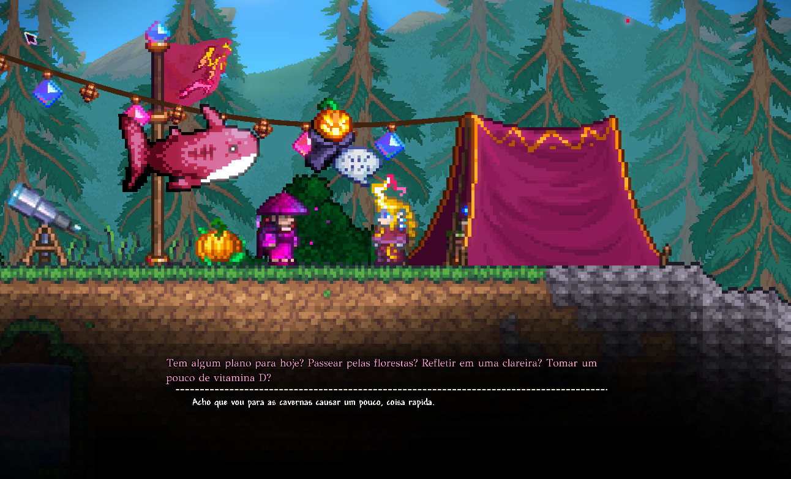

## Calamity Wrath of the Gods PT-BR

Terraria é um dos jogos mais baixados da steam e possui uma comunidade muito ativa no Brasil. além do conteúdo original, o jogo conta com uma grande variedade de modificações criadas pela própria comunidade.

O tModLoader é uma plataforma que permite criar e instalar modificações para o Terraria, adicionando novos conteúdos ao jogo, como mods, itens, músicas, texturas, sistemas e etc.

Entre os mods mais conhecidos está o Calamity Mod, uma das maiores e mais populares modificações do Terraria. Como um add-on do Calamity Mod, existe o Wrath of the gods que adiciona novos conteúdos e desafios ao jogo.
##
### Tradução

O Wrath of the Gods está disponível apenas em inglês, e este projeto fornece uma tradução para Português do Brasil para a comunidade Brasileira.

A tradução busca preservar o significado original, mas com uma tradução totalmente diferente da original com uma linguagem mais natural, fazendo uma adaptação mais natural da língua portuguesa.
##
### problemas com acentuação

O mod utiliza uma fonte com limitações na exibição de caracteres acentuados. Por isso, algumas palavras em diálogos e descrições foram intencionalmente adaptadas sem acentuação, buscando preservar a fluidez da leitura e o visual dentro do jogo.

Exemplo de dialogos sem acentuação:

##
Tradução independente e não oficial para a comunidade Brasileira de Terraria.

